## 🌱 Open Source Contributions

  

<table width="100%">
<tr>
<td width="50%" align="center">

### 🤖 OpenAI Agents SDK

**Merged PRs**

`#3884` • `#3921` • `#3965`

Voice Pipeline • SDK Improvements • Bug Fixes

</td>

<td width="50%" align="center">

### 🦾 Google ADK

**Merged Contributions**

Documentation • Examples • Improvements

Official Contributor

</td>
</tr>

<tr>
<td width="50%" align="center">

### 🐾 OpenClaw

Documentation • CLI • Developer Experience

Community Contributions

</td>

<td width="50%" align="center">

### ⚡ n8n

Workflow Improvements

Automation Ecosystem

</td>
</tr>
</table>

 

> Building reliable developer tools through bug fixes, documentation improvements, feature enhancements, and ecosystem contributions.

